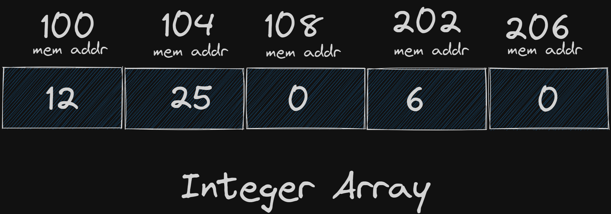

# Arrays and Strings

**Yes. Array. I know you are all thinking... "but i know this."**

Arrays are like old friends in the vast universe of data structures—familiar, reliable, and ever-present. We often turn to them for their straightforwardness and dependability, much like we seek solace in the company of a trusted companion. Yet, like any friendship, arrays have their quirks and peculiarities, sometimes leading us into performance conundrums that require a bit of ingenuity to resolve.

Despite these challenges, we cherish arrays for their unwavering steadfastness. They are the building blocks of countless algorithms, the dependable backbone of our data handling. In the world of computing, as in life, we embrace both the strengths and the idiosyncrasies of our companions. Arrays, with all their virtues and flaws, remain our loyal allies—guiding us through the labyrinth of code with their time-tested simplicity and reliability.

In this section, we will delve into our first data structure, the array. Commonly found in most programming languages, arrays are used to store lists of items sequentially. Not only will we explore how to use arrays in C++, but we will also take a look at their usage in other programming languages such as JavaScript, Rust, and Go. Additionally, we will guide you on how to build your own array class.

## What are Arrays ?

Arrays are one of the simplest and most commonly used data structures. They store a list of items such as numbers, strings, or any other data type, in sequential order in memory.

If you allocate an array of five integers like this `int arr[5] = {1,2,3,4,5};`these numbers will be stored in memory lets say the address of the first item in memory is 100.



As you may or may not know:

- **C/C++ on Most Compilers:** On most 64-bit systems, such as those using GCC, Clang, or MSVC, an `int` is usually 4 bytes (32 bits). This is consistent with the ILP32 data model, where `int`, `long`, and pointer types have different sizes.
- **Java:** In Java, an `int` is always 4 bytes (32 bits), regardless of the platform.

So, the address of the second item will be 104 and so on. This is why looking up items in an array by index is super fast—we give an array an index, and it can determine exactly which place in memory to access.

The runtime complexity of this operation is O(1), and not O(n), because the calculation of the memory address is very simple.

If you need to store a list of items and access them by their index, arrays are the optimal data structures for you.

However, arrays do have their limitations:

- You must know exactly how many elements you want to store in the array upfront.

But, what if we don’t know?

In that case, you need to make an educated guess. If your guess is too high, you will waste memory. But, if it's too low, your array gets filled quickly, which means we have to allocate a new array and copy the old items to the newly created, larger array. This operation is costly and the runtime complexity of it is O(n).

## Working with arrays in C++

### C-Style Arrays

C-style arrays are basic, fixed-size arrays. They are part of the C programming language and are also available in C++.

```cpp

#include <iostream>
int main() {
    // C-style array
    int cArray[5] = {1, 2, 3, 4, 5};

    // Accessing elements
    std::cout << "C-Style Array:" << std::endl;
    for(int i = 0; i < 5; ++i) {
        std::cout << cArray[i] << " ";
    }
    std::cout << std::endl;

    return 0;
}

```

### `std::array`

`std::array` is a container that encapsulates fixed-size arrays and provides additional functionality. It is part of the C++ Standard Library (introduced in C++11).

```cpp
cppCopy code
#include <iostream>#include <array>int main() {
    // std::array
    std::array<int, 5> stdArray = {1, 2, 3, 4, 5};

    // Accessing elements
    std::cout << "std::array:" << std::endl;
    for(int i = 0; i < stdArray.size(); ++i) {
        std::cout << stdArray[i] << " ";
    }
    std::cout << std::endl;

    return 0;
}

```

### `std::vector`

`std::vector` is a dynamic array that can change size. It is also part of the C++ Standard Library.

```cpp
cppCopy code
#include <iostream>#include <vector>int main() {
    // std::vector
    std::vector<int> vec = {1, 2, 3, 4, 5};

    // Accessing elements
    std::cout << "std::vector:" << std::endl;
    for(int i = 0; i < vec.size(); ++i) {
        std::cout << vec[i] << " ";
    }
    std::cout << std::endl;

    // Adding an element
    vec.push_back(6);
    std::cout << "After push_back(6):" << std::endl;
    for(int i = 0; i < vec.size(); ++i) {
        std::cout << vec[i] << " ";
    }
    std::cout << std::endl;

    return 0;
}

```

### Summary

1. **C-Style Arrays:** Fixed-size and simple, but lack bounds checking and other safety features.
2. **`std::array`:** Fixed-size array with added safety and functionality from the C++ Standard Library.
3. **`std::vector`:** Dynamic array that can grow or shrink in size, providing flexibility and many utility functions.

These examples show how to declare, initialize, and access elements in each type of array in C++.

## Working with arrays in rust

### Fixed-Size Arrays

Rust arrays have a fixed size and are defined with a specific length.

```rust
fn main() {
    // Fixed-size array
    let fixed_array: [i32; 5] = [1, 2, 3, 4, 5];

    // Accessing elements
    println!("Fixed-size array:");
    for i in 0..fixed_array.len() {
        println!("Element {}: {}", i, fixed_array[i]);
    }
}

```

### Slices

Slices are dynamically-sized views into arrays or vectors. They do not have ownership of the data.

```rust
fn main() {
    // Fixed-size array
    let fixed_array: [i32; 5] = [1, 2, 3, 4, 5];

    // Creating a slice
    let slice: &[i32] = &fixed_array[1..4];

    // Accessing elements
    println!("Slice:");
    for i in 0..slice.len() {
        println!("Element {}: {}", i, slice[i]);
    }
}

```

### Vectors

Vectors are dynamically-sized arrays provided by the Rust standard library. They can grow or shrink in size.

```rust
rustCopy code
fn main() {
    // Vector
    let mut vec: Vec<i32> = vec![1, 2, 3, 4, 5];

    // Accessing elements
    println!("Vector:");
    for i in 0..vec.len() {
        println!("Element {}: {}", i, vec[i]);
    }

    // Adding an element
    vec.push(6);
    println!("After push(6):");
    for i in 0..vec.len() {
        println!("Element {}: {}", i, vec[i]);
    }
}

```

### Summary

1. **Fixed-Size Arrays:** Arrays with a compile-time fixed size.
2. **Slices:** Dynamically-sized views into arrays or vectors.
3. **Vectors:** Dynamic arrays that can change size at runtime.

These examples demonstrate how to declare, initialize, and access elements in each type of array in Rust.

## Working with arrays in go

### Arrays in Go

Arrays in Go are fixed-size sequences of elements of the same type. They are declared with a specific length and are not resizable.

```go
package main

import "fmt"

func main() {
    // Array in Go
    var arr [5]int = [5]int{1, 2, 3, 4, 5}

    // Accessing elements
    fmt.Println("Array in Go:")
    for i := 0; i < len(arr); i++ {
        fmt.Printf("Element %d: %d\n", i, arr[i])
    }
}

```

### Slices in Go

Slices are dynamic data structures built on top of arrays in Go. They provide a more flexible way to work with sequences of data. Slices are like references to arrays with additional properties.

```go
goCopy code
package main

import "fmt"

func main() {
    // Slice in Go
    slice := []int{1, 2, 3, 4, 5}

    // Accessing elements
    fmt.Println("Slice in Go:")
    for i, v := range slice {
        fmt.Printf("Element %d: %d\n", i, v)
    }

    // Modifying a slice (adding an element)
    slice = append(slice, 6)
    fmt.Println("After append(6):", slice)
}

```

### Key Differences and Considerations

1. **Flexibility:** Slices are more flexible than arrays because they can grow or shrink dynamically using the `append` function.
2. **Underlying Array:** Slices are references to arrays. They include a pointer to the underlying array, a length, and a capacity, making them more powerful for managing collections of data.
3. **No Vector Type:** Unlike languages like C++ or Java, Go does not have a built-in `vector` type with dynamic resizing and methods like `push_back` or `pop_back`. Instead, slices are used for similar purposes.
4. **Performance:** Slices can be more efficient in Go compared to traditional dynamic arrays in other languages due to their design and the way they manage memory.

Understanding slices and arrays in Go is crucial for effective Go programming. Slices are commonly used in Go for their flexibility and ease of use in managing collections of data, making them suitable for various tasks ranging from simple data manipulation to complex concurrent operations.

last but not least 🙂🙂.

## Working with arrays in Node

you can refer to my blog **Different Types of Arrays in JavaScript because honesty node is different in the way it handles memory and array in node aren’t actually arrays . i mean `const a=[]` is not an array and we can talk about why.**

Article

### Basic Arrays

In Node, you can create and work with basic arrays .

```tsx
function main() {
    // Basic array
    let basicArray: number[] = [1, 2, 3, 4, 5];

    // Accessing elements
    console.log("Basic array:");
    for (let i = 0; i < basicArray.length; i++) {
        console.log(`Element ${i}: ${basicArray[i]}`);
    }
}

main();

```

### Typed Arrays

TypeScript allows you to specify the type of elements in an array for better type safety.

```tsx
typescriptCopy code
function main() {
    // Typed array
    let typedArray: Array<number> = [1, 2, 3, 4, 5];

    // Accessing elements
    console.log("Typed array:");
    for (let i = 0; i < typedArray.length; i++) {
        console.log(`Element ${i}: ${typedArray[i]}`);
    }
}

main();

```

### Using the `Array` Class

TypeScript's `Array` class provides various methods to work with arrays, such as `push`, `pop`, `map`, `filter`, etc.

```tsx
function main() {
    // Using the Array class
    let array: number[] = [1, 2, 3, 4, 5];

    // Accessing elements
    console.log("Array class:");
    for (let i = 0; i < array.length; i++) {
        console.log(`Element ${i}: ${array[i]}`);
    }

    // Adding an element
    array.push(6);
    console.log("After push(6):");
    for (let i = 0; i < array.length; i++) {
        console.log(`Element ${i}: ${array[i]}`);
    }
}

main();

```

### Summary

1. **Basic Arrays:** Arrays that can hold elements of any type, similar to JavaScript arrays.
2. **Typed Arrays:** Arrays with specified element types for better type safety.
3. **Using the `Array` Class:** Utilizing the methods provided by the `Array` class to manipulate arrays.

These examples show how to declare, initialize, and access elements in each type of array in TypeScript.

In TypeScript/JavaScript, arrays differ from statically typed languages like Rust or C++ primarily in how they handle type safety and flexibility:

1. **Dynamic Typing:** TypeScript and JavaScript arrays can hold elements of any type in the same array. This dynamic typing allows arrays to store heterogeneous data (e.g., numbers, strings, objects) without explicit type declarations for each element.
2. **Flexible Size:** Arrays in TypeScript/JavaScript are dynamically sized and can grow or shrink as elements are added or removed. This flexibility is convenient but can lead to runtime errors if not handled carefully.
3. **Implicit Type Conversion:** Due to dynamic typing, elements in TypeScript/JavaScript arrays can be implicitly converted between types. For example, an array can contain both numbers and strings without explicit conversions.
4. **Type Annotations:** TypeScript allows you to annotate arrays with specific element types using type annotations, improving type safety. However, this is optional and does not enforce strict typing as in statically typed languages.
5. **Standard Library Features:** Arrays in TypeScript/JavaScript come with a rich set of built-in methods (`push`, `pop`, `map`, `filter`, etc.) provided by the Array prototype, making them powerful tools for data manipulation.

In contrast, statically typed languages like Rust or C++ enforce strict typing and fixed-size arrays by default, which provides better compile-time safety and performance optimization. Rust's arrays and slices, for instance, are more explicit about size and ownership, contributing to safer memory management and concurrency control.

Understanding these differences helps developers choose the right language and approach for their specific programming needs, balancing between flexibility and type safety.

## Implementing an array class in C++

### Test cases

```cpp
#include <gtest/gtest.h>
#include "../ds/array/array.hpp"

using namespace customDataStructures;

TEST(ArrayTest, IsEmptyInitially)
{
    Array<int> arr(5);
    EXPECT_TRUE(arr.isEmpty());
}

TEST(ArrayTest, InsertAndCheckSize)
{
    Array<int> arr(5);
    arr.insert(10);
    EXPECT_FALSE(arr.isEmpty());
    EXPECT_EQ(arr.get(0), 10);
}

TEST(ArrayTest, RemoveAt)
{
    Array<int> arr(5);
    arr.insert(10);
    arr.insert(20);
    arr.insert(30);
    arr.remove_at(1);
    EXPECT_EQ(arr.get(1), 30);
    EXPECT_EQ(arr.size, 2);
}

TEST(ArrayTest, ResizeArray)
{
    Array<int> arr(2);
    arr.insert(10);
    arr.insert(20);
    arr.insert(30);
    EXPECT_EQ(arr.get(2), 30);
    EXPECT_EQ(arr.cap, 4);
}

TEST(ArrayTest, GetAndSet)
{
    Array<int> arr(5);
    arr.insert(10);
    arr.set(0, 20);
    EXPECT_EQ(arr.get(0), 20);
}

TEST(ArrayTest, ClearArray)
{
    Array<int> arr(5);
    arr.insert(10);
    arr.insert(20);
    arr.clear();
    EXPECT_TRUE(arr.isEmpty());
    EXPECT_EQ(arr.size, 0);
}

TEST(ArrayTest, InsertUntilResize)
{
    Array<int> arr(2);
    arr.insert(1);
    arr.insert(2);
    arr.insert(3); // This should trigger a resize
    EXPECT_EQ(arr.cap, 4);
    EXPECT_EQ(arr.size, 3);
    EXPECT_EQ(arr.get(2), 3);
}

TEST(ArrayTest, RemoveAtBoundaries)
{
    Array<int> arr(5);
    arr.insert(10);
    arr.insert(20);
    arr.insert(30);
    arr.remove_at(0); // Remove first element
    EXPECT_EQ(arr.get(0), 20);
    arr.remove_at(1); // Remove last element
    EXPECT_EQ(arr.size, 1);
}

TEST(ArrayTest, GetOutOfBounds)
{
    Array<int> arr(5);
    arr.insert(10);
    EXPECT_THROW(arr.get(1), std::out_of_range);
    EXPECT_THROW(arr.get(-1), std::out_of_range);
}

TEST(ArrayTest, SetOutOfBounds)
{
    Array<int> arr(5);
    arr.insert(10);
    EXPECT_THROW(arr.set(1, 20), std::out_of_range);
    EXPECT_THROW(arr.set(-1, 20), std::out_of_range);
}

TEST(ArrayTest, ClearAndInsert)
{
    Array<int> arr(5);
    arr.insert(10);
    arr.insert(20);
    arr.clear();
    EXPECT_TRUE(arr.isEmpty());
    arr.insert(30);
    EXPECT_EQ(arr.get(0), 30);
    EXPECT_EQ(arr.size, 1);
}

int main(int argc, char **argv)
{
    ::testing::InitGoogleTest(&argc, argv);
    return RUN_ALL_TESTS();
}
```

Implementation

```cpp
#include <iostream>

namespace customDataStructures
{
    template <typename T>
    class Array
    {
    public:
        size_t cap;
        T *entries;
        int size = 0;
        Array(size_t capacity)
        {
            this->cap = capacity;
            entries = new T[capacity]{};
        }
        ~Array()
        {
            delete[] entries;
        }
        void print_me()
        {
            for (size_t i = 0; i < cap; i++)
            {
                std::cout << this->entries[i] << "\n";
            }
        }
        bool isEmpty()
        {
            return size == 0;
        }
        void insert(T value)
        {
            if (size == cap)
            {
                resize_array();
            }
            entries[size] = value;
            this->size++;
        }
        void resize_array()
        {
            T *new_entries = new T[cap * 2]{};
            for (size_t i = 0; i < cap; i++)
            {
                new_entries[i] = this->entries[i];
            }
            delete[] this->entries;
            this->entries = new_entries;
            this->cap = cap * 2;
        }
        void remove_at(int index)
        {
            if (index < 0 || index >= size)
            {
                std::cerr << "Index out of bounds\n";
                return;
            }
            for (int i = index; i < size - 1; i++)
            {
                entries[i] = entries[i + 1];
            }
            size--;
        }
    };
}

```